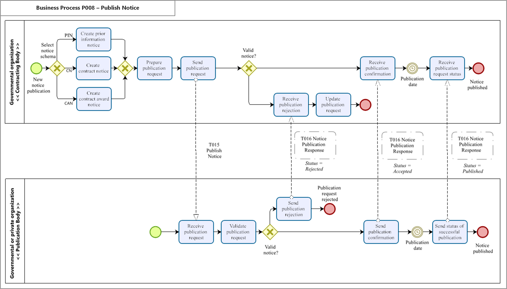

= Business process

The following {link-bpmn}[BPMN] diagram shows the choreography of the business process implemented by the profile. The choreography of business collaborations defines the sequence of interactions when the profile is run within its context.

[NOTE]
Process will be described as soon as its finalized

The process starts with the contracting body issuing a new publication notice. At first, they have to choose which kind of notice has to be published (PIN, CN or CAN). After that the publication request will be prepared and send to the publication body. Transaction T015 is used for the message to the publication body.

Depending on the validity of the message, the process continues for the contracting body with the receipt of the rejection. The rejection is submitted by the publication body, after they checked the validity of the notice via T016 with the status "Rejected". The contracting body now updates the request. With this action the process ends for both parties.

In case of a valid notice the contracting body receives a publication confirmation via T016 with the status "Accepted" from the publication body. After both parties wait for the desired publication date the publication body sends a status update via T016 with the status "Published" to confirm the successful publication of the notice. This ends the process finishes the process for the publication office. The same goes for the contracting body, which ends the process with the receipt of the publication request status. The notice has been published.

[NOTE]
Transaction T016 needs to be created.

[cols="2,10", options="header"]
.Business process
|===
| Category | Description
| Description
| A contracting body requests a publication body to publish a prior information/ contract notice/ contract award notice. The publication body assesses the request and may ask for corrections. Small corrections may be applied by the publication body itself. When the notice to be published meets the criteria, it is published or filed if confidential.
| Pre-conditions | The contracting body prepared a prior information/ contract notice.
| Post-conditions	| The prior information/ contract notice/ contract award notice is published.

|===

[cols="3,2,7", options="header"]
.Role description
|===
| Activity | Role involved | Description
| Prepare publication request |Contracting body | The contracting body prepares a publication request
| Send publication request | Contracting body | The contracting body sends the request to publish the notice to the publication body
| Receive publication request | Publication body | The publication body receives the publication request
| Send publication request receipt confirmation	| Publication body | The publication body confirms the receipt of the publication request. This is an optional step, publication bodies may not send confirmations but offer contracting bodies means to track the status of the publication.
| Assess publication request | Publication body | The publication body assesses the validity of the publication request
| Reject publication request | Publication body	| If the request is not valid, the publication body rejects it
| Prepare publication | Publication body | The publication body prepares the publication and assesses the contents of the notice
| Request/suggest publication request correction | Publication body | The publication body may request and/or suggest corrections of the request to the contracting body by ordinary email. The process stops here. The contracting body prepares a new (corrected) request.
| Receive publication request correction | Contracting body | The contracting body receives a publication request correction.
| Send publication request publication confirmation | Publication body | The publication body sends a confirmation that the notice is published and in parallel publishes the notice.
| Receive publication request publication confirmation | Contracting body | The contracting body receives a confirmation that the notice is published. The process ends.
| File | Publication body | In case of a confidential notice, the publication body files the notice instead of publishing it
| Publish | Publication body | The notice is published

|===

:leveloffset: +1

include::implementation-guidelines.adoc[]

:leveloffset: -1

