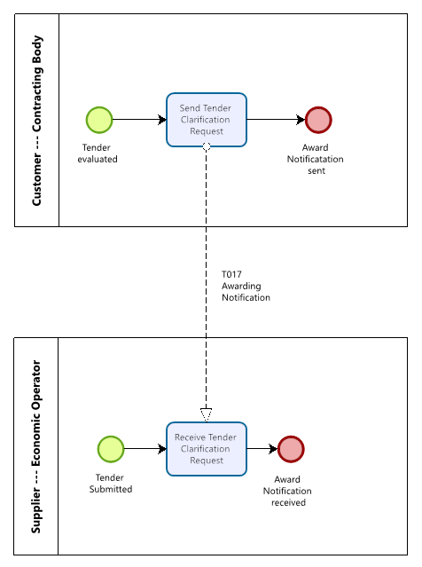

= Business process

The following diagram shows the choreography of the business process implemented by the profile. The choreography of business collaborations defines the sequence of interactions when the profile is run within its context.

[cols="2,10", options="header"]
.Business process
|===
| Category | Description
| Description | A contracting body sends an awarding notification to an economic operator who participated in the tendering procedure.

| Pre-conditions | The economic operator has submitted his tender and the contracting body has the tender evaluated.
| Post-conditions | The award notification has been received and can be evaluated by the economic operator.

|===

[cols="3,2,7", options="header"]
.Role description
|===
| Activity | Role involved | Description
| Send Awarding Notification | Contracting body | The tender awarding notification is send by the economic operator.
| Receive Awarding Notification | Economic operator | The economic operator receives the notification for the awarding of the tendering process.

|===

:leveloffset: +1

include::implementation-guidelines.adoc[]

:leveloffset: -1
