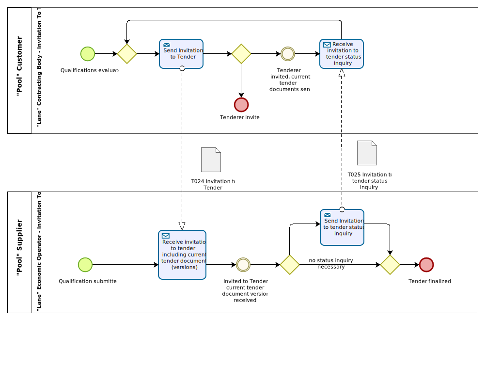

= Business process

The {link-bpmn}[BPMN] diagram shows the choreography of the business process implemented by the {name-profile}. The choreography of business collaborations defines the sequence of interactions when the profile is run within its context.

[cols="3,9", options="header"]
|===
| Category
| Description
| Description
| The contracting body sends an electronic invitation to tender document containing the information required for the economic operator to participate in a tendering process.
The contracting body may send a formal invitation to tender as an attachment to the call for tenders document.
The economic operator evaluates the information given with the invitation to tender and decides whether to accept the invitation or to reject it.
If the economic operator accepts the invitation, the business process follows through an external process.
If the economic operator rejects the invitation, no notification needs to be sent back to the contracting body.

| Pre-conditions
| The contracting body had pre-selected a list of candidate economic operators (shortlist).

| Post-conditions
| The economic operator has received the invitation to tender and can proceed to prepare and submit the qualification or tender.

| Remarks
| The invitation to tender is for a negotiated procedure where the economic operator could not have all the call for tenders information.
|===

[cols="3,2,7", options="header"]
|===
| Activity
| Role involved
| Description
| Send invitation to tender
| Contracting body
| The contracting body sends an invitation to tender to an economic operator.
| Receive invitation to tender
| Economic operator
| The economic operator receives the invitation to tender, enabling him to prepare a bid.
| Send Invitation to Tender Status Inquiry
| Economic Operator
| The economic operator (regularly) asks for Tender Document Status changes.
| 
|===

include::implementation-guidelines.adoc[]

