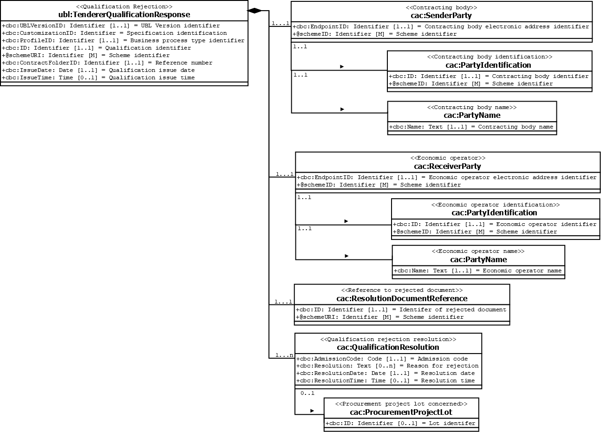

== Data model diagram

The following transaction data model illustrates the classes and information elements of {name-transaction}.

== XML example

The following XML example illustrates the structure of an instance of {name-transaction}.

link:files/QualificationRejection.xml[Link to example file]

[source,xml,indent=0]
----

include::../files/QualificationRejection.xml[tag=**]

----

